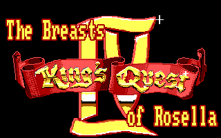

# King’s Quest IV: The Breasts of Rosella

A mod for King's Quest IV that adds new puzzles, solutions, QoL changes, sequence breaks, dialogue changes and more.

Content advisory: Adult situations, drug references, suicide and nudity.

## INSTALLATION

Clone the repo or download the <a href="https://github.com/Doomlazer/KQIV-TBoR/releases/download/v1.1/KQIV-TBoR_v1.1.zip">most recent release</a>. Then copy the PATCHES folder into your KQ4 game folder and start normally through ScummVM. 

Remove the PATCHES folder to uninstall.

This mod should only be used with ScummVM - It has heap crashes in DOSbox and retro hardware.

## About

This project started life as an ironic 'nude patch' for KQ4 and grew from there as I learned what was possible with <a href="http://scicompanion.com">SCI Companion</a>. Yes, a KQ4 nude patch is a stupid idea, but I painted myself into a corner and now I'm stuck with it. 

Keep in mind this is a parody. There is nothing titillating about EGA nudity. The mod is intended to be viewed as if it was developed in the 80s by a horny 13 year old boy (that somehow had tools to mod SCI games). It's intentionally crude, often poorly executed and sometimes offensive - that is the asthetic. The game does not reflect my personal additudes, or modern sensibilities. 

After recieving feedback on some questionable content in the original release version, I decided to dial back the more offensive sequences. Those desperate to experience the original version may download the <a href="https://github.com/Doomlazer/KQIV-TBoR/releases/download/v1.0/KQ4-TBoR-Patcher.exe">original release installer</a>. 

Features: See <a href="https://github.com/Doomlazer/KQIV-TBoR/wiki">the wiki</a> for all changes/additions and walkthrough.

